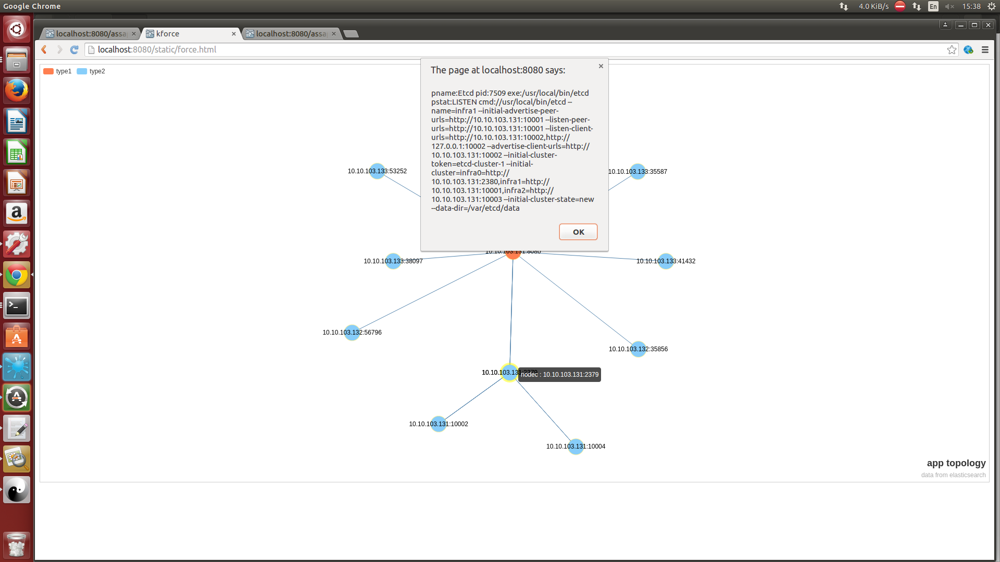
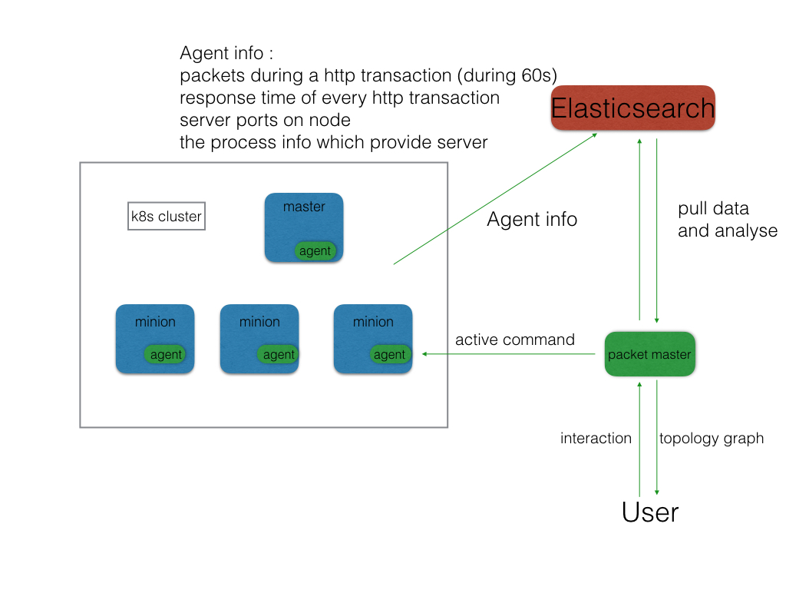

###CPMonitor(Container Packet Monitor)
A tool wich used to 

###Master
collect the info from elasticsearch
show the topology graph of the cluster interactively

###Agent
sniff the specific port on nodes 
collect the process info on nodes

###Existing function
this is a demo version , the basic short screen is like this:

the basic architecture:

###Next Step